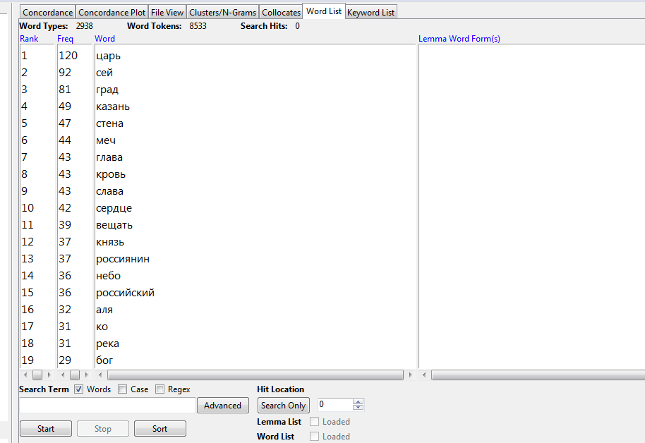
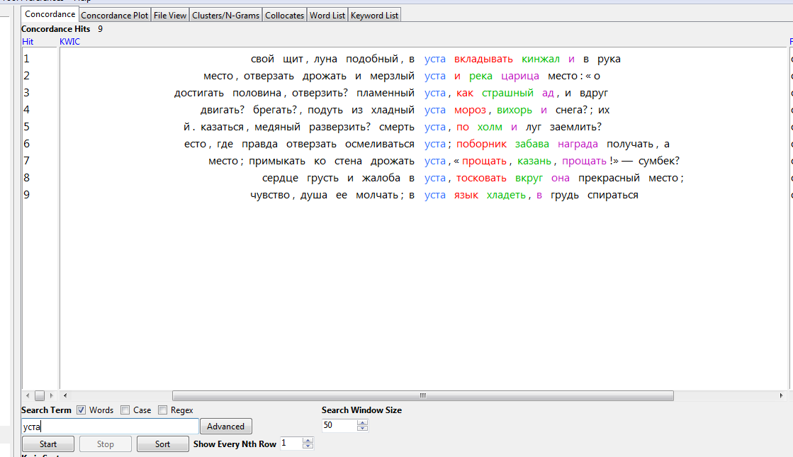
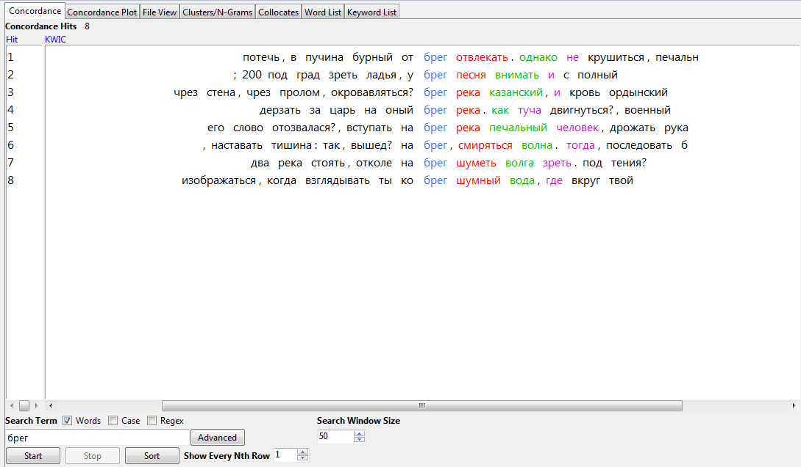
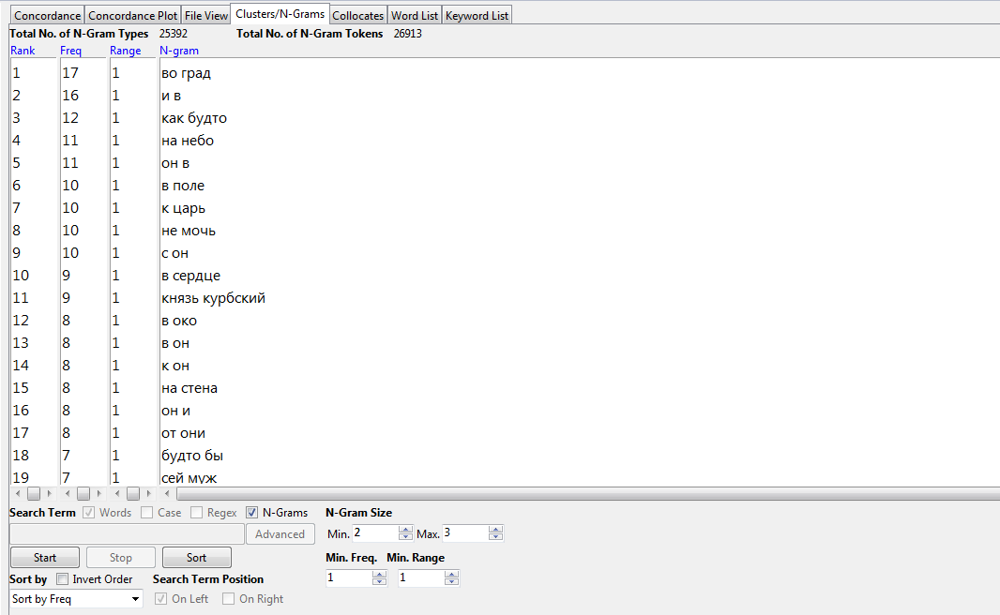
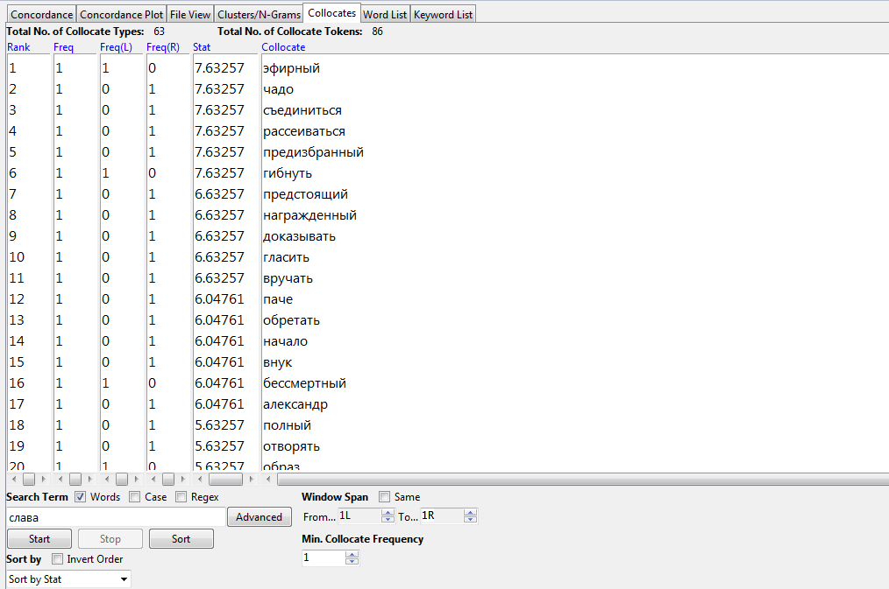

# HW3

3) Частотность слов после добавление стоп-списка.
 
4) Конкордансы устаревших слов.
Конкорданс слова "град".

Конкорданс слова "уста".

Конкорданс слова "брег".

5) 2-, 3-нграмы.

6) Коллокаты слова "слава"

